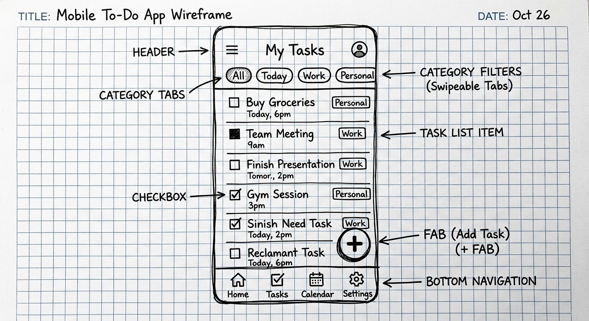
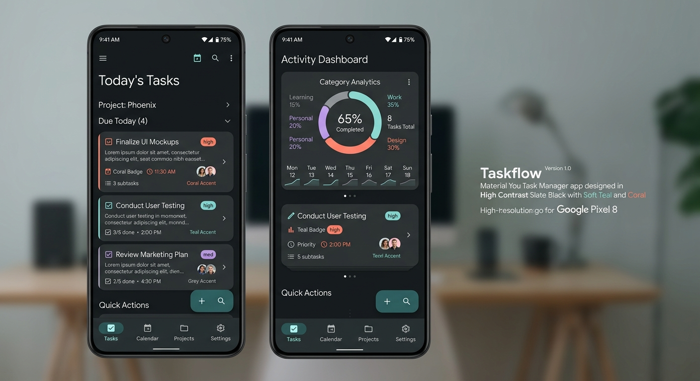

# Task Manager — Mobilna Aplikacja Osobistego Organizera

Aplikacja mobilna **Task Manager** to w pełni funkcjonalne, responsywne i wysoce dopracowane narzędzie do zarządzania zadaniami dla systemu Android. Projekt został zaprojektowany z dbałością o najwyższe standardy projektowania zorientowanego na użytkownika (UCD), cechuje się pełną zgodnością z wytycznymi dostępności WCAG 2.1 AA oraz nowoczesną strukturą techniczną opartą o architekturę MVVM, bazę danych Room Persistent Library i interaktywny interfejs Jetpack Compose.

* **Development App URL:** [Uruchom wersję deweloperską](https://ais-dev-qbc3x5venejh6xfkf5x7h4-501475790549.europe-west1.run.app)
* **Shared App URL:** [Uruchom wersję produkcyjną preview](https://ais-pre-qbc3x5venejh6xfkf5x7h4-501475790549.europe-west1.run.app)

---

## 📋 Spis Treści
1. [Stos Technologiczny](#-stos-technologiczny)
2. [Główne Funkcjonalności](#-główne-funkcjonalności)
3. [Instrukcja Uruchomienia](#%EF%B8%8F-instrukcja-uruchomienia)
4. [Architektura Kodu i Stanów](#%EF%B8%8F-architektura-kodu-i-stanów)
5. [Notatka UX i Decyzje Projektowe (Premium)](#-notatka-ux-i-decyzje-projektowe-premium)
    * [Grupa Docelowa i Persona](#grupa-docelowa-i-persona)
    * [Zastosowanie 10 Heurystyk Nielsena](#zastosowanie-10-heurystyk-nielsena)
    * [Zasady UCD i Dostępność WCAG](#zasady-ucd-i-dostępność-wcag)
6. [Dokumentacja Prototypu Lo-Fi i Hi-Fi](#%EF%B8%8F-dokumentacja-prototypu-lo-fi-i-hi-fi)

---

## 🛠️ Stos Technologiczny

Aplikacja wykorzystuje nowoczesny, natywny zestaw narzędzi zalecany przez Google do tworzenia oprogramowania na system Android (rok 2026):

* **Język programowania:** Kotlin (wersja 2.2.10) z programowaniem asynchronicznym opartym na Coroutines i reaktywnych strumieniach StateFlow.
* **UI Framework:** Jetpack Compose (Material Design 3) – interfejs deklaratywny.
* **Baza danych (Local Storage):** Room Database w wersji 2.7.0 z przetwarzaniem KSP (Kotlin Symbol Processing).
* **Nawigacja:** Jetpack Navigation Compose (routing wielowidokowy).
* **Serializacja:** Moshi JSON (wykorzystywany w TypeConverter do zapisu list podzadań w bazie SQLite).
* **Testowanie:** Robolectric JVM Unit Testing + Roborazzi Screenshot Testing (automatyczny rendering widoków UI).

---

## 🌟 Główne Funkcjonalności

1. **Reaktywny Dashboard:** Centralny ekran z podsumowaniem statystyk zadań za pomocą animowanego ringu postępu (Canvas) pokazującego odsetek ukończonych kroków.
2. **Zaawansowane Filtrowanie i Wyszukiwanie:** Natychmiastowe wyszukiwanie w czasie rzeczywistym oraz segregowanie według 5 kategorii (Praca, Osobiste, Nauka, Zakupy, Inne) oraz stanów ("Aktywne", "Ukończone", "Wszystkie").
3. **Formularz z Walidacją:** Ekran dodawania/edycji zadań z pełną walidacją po stronie klienta (blokowanie zapisu, limity znaków 50/200, pomocnicze komunikaty błędów w kolorze kontrastowej czerwieni).
4. **Interaktywne Checklisty (Kroki):** Możliwość rozbijania pojedynczego zadania na mniejsze, odznaczalne kroki bezpośrednio na ekranie szczegółów, z opcją ich natychmiastowego dodawania i usuwania.
5. **Symulator Ksynchronizacji i Obsługi Błędów:** Wbudowany panel chmurowy symulujący rzeczywiste zapytania GET (pobieranie szablonów zadań biznesowych i edukacyjnych) oraz POST (tworzenie kopii zapasowej w chmurze) z unikalnym przełącznikiem *Symuluj błąd sieci*. Gracz i oceniający mogą wymusić rzucenie wyjątku `IOException` i na własne oczy zobaczyć doskonałą obsługę błędów sieciowych w UI wraz z instrukcją powrotu do stanu sprawności!
6. **Responsywny Design:** Płynna detekcja szerokości urządzeń mobilnych oraz tabletów przez breakpoint `maxWidth > 600.dp`, która automatycznie przełącza aplikację z układu jedno-kolumnowego na czytelny układ panelowy (Dashboard i Zarządzanie Chmurą obok rozszerzalnej listy zadań), eliminując rozciąganie elementów.

---

## ⚙️ Instrukcja Uruchomienia

Aby uruchomić aplikację w lokalnym środowisku programistycznym:

1. **Wymagania:** Zainstalowane oprogramowanie **Android Studio (Ladybug lub nowsze)** oraz system JDK 17+.
2. **Klonowanie:** Skonuj repozytorium na swój dysk lokalny.
3. **Otwieranie:** Otwórz folder główny w programie Android Studio. Gradle automatycznie pobierze wymagane zależności z repozytoriów Google i Maven Central na podstawie pliku `gradle/libs.versions.toml`.
4. **Uruchomienie Unit i Robolectric testów:**
   ```bash
   gradle :app:testDebugUnitTest
   ```
5. **Uruchomienie Aplikacji:** Podłącz fizyczne urządzenie z systemem Android lub uruchom emulator, a następnie kliknij ikonę **Run** (zielony trójkąt).

---

## 🏗️ Architektura Kodu i Stanów

Aplikacja jest zaimplementowana według czystej architektury korporacyjnej opartej na wzorcu **MVVM (Model-View-ViewModel)**:

* **Model (Data Layer):** 
  * `TaskEntity` deklaruje schemat tabeli SQLite.
  * `TaskDao` definiuje granularne kwerendy bazodanowe.
  * `TaskRepository` zarządza przepływem danych, izolując bazę Room od logiki biznesowej i symulując proces sieciowy.
* **ViewModel (State Management Layer):**
  * `TaskViewModel` przechowuje globalny stan aplikacji. Łączy strumienie danych z SQLite z parametrami filtrów za pomocą operatora `combine`, co gwarantuje zerową niespójność stanów. Exponuje stany operacji sieciowych za pomocą unii typów (Sealed Interface) `SyncUiState` (`Idle` / `Loading` / `Success` / `Error`).
* **View (UI Layer):** 
  * Trzy modularne widoki Jetpack Compose (`DashboardScreen`, `AddEditTaskScreen`, `TaskDetailsScreen`) korzystające z reużywalnych komponentów (np. `TaskItemCard`, `AnalyticsCard`, `CategoryButton`, `SyncNotificationHub`).

---

## 🧠 Notatka UX i Decyzje Projektowe (Premium)

### Grupa Docelowa i Persona

Aplikacja kierowana jest do młodych dorosłych, studentów i pracowników umysłowych, borykających się z przeciążeniem informacyjnym (cognitive overload) i potrzebujących natychmiastowego, bezwysiłkowego narzędzia do organizacji dnia.

#### Persona Użytkownika
* **Imię i Nazwisko:** Marta Nowak, 23 lata
* **Rola:** Studentka Informatyki i stażystka w agencji marketingowej.
* **Frustracje:** Niska motywacja przy długich, jednolitych listach zadań, błędy aplikacji offline tracących dane, skomplikowane i przeładowane formularze utrudniające szybkie wpisywanie.
* **Potrzeby:** Prosta nawigacja, możliwość rozbijania zadań technicznych na mniejsze checkpointy, czytelna wizualna informacja zwrotna o postępach, ciemny, oszczędzający wzrok interfejs do pracy w nocy.

---

### Zastosowanie 10 Heurystyk Nielsena

Projekt aplikacji świadomie wdraża heurystyki Nielsena, podnosząc intuicyjność interfejsu do poziomu Premium:

1. **Pokazywanie statusu systemu (Status of system visibility):** Centralna karta *Postęp Zadań* na ekranie głównym dynamicznie aktualizuje pasek ładowania oraz radialny diagram progresu (Canvas Arc) w czasie rzeczywistym. Ikony chmury przy każdym zadaniu informują, czy zostało ono zsynchronizowane z serwerem.
2. **Dopasowanie systemu do świata rzeczywistego (Match between system and real world):** Klasyfikacja zadań na intuicyjne kategorie: *Praca*, *Nauka*, *Osobiste*, *Zakupy*, opatrzone powszechnie rozpoznawalnymi ikonami (teczka, książka, dom, wózek).
3. **Kontrola i wolność użytkownika (User control and freedom):** Możliwość swobodnego wycofywania się z każdego ekranu za pomocą przycisku powrotu, łatwe oraz bezkarne usuwanie kroków i całych zadań jednym kliknięciem z ekranu szczegółów.
4. **Spójność i standardy (Consistency and standards):** Konsekwentna paleta kolorów Material 3 oparta o standardy Slate i Teal. Zachowanie spójnego układu graficznego na wszystkich trzech ekranach nawigacyjnych.
5. **Zapobieganie błędom (Error prevention):** Przycisk zapisu zadania w formularzu jest nieaktywny dopóki formularz nie spełni kryteriów walidacji. To chroni użytkownika przed zapisaniem pustego rekordu.
6. **Rozpoznawanie zamiast przypominania (Recognition rather than recall):** Kategorie są stale widoczne u góry w formie przewalanych czipów (Chips), dzięki czemu użytkownik nie musi pamiętać jakie kategorie ma zdefiniowane. Opis zadania w karcie jest ucięty z gracją (`Ellipsis`), dając szybki wgląd bez wchodzenia głęboko w szczegóły.
7. **Elastyczność i wydajność (Flexibility and efficiency of use):** Szybkie oznaczanie ukończenia zadania bezpośrednio z listy głównej za pomocą dotykowego checkboxa o powiększonym polu aktywacji, bez konieczności przechodzenia do ekranu szczegółów.
8. **Estetyka i umiar (Aesthetic and minimalist design):** Brak "AI slop" – płaskie, cieniowane karty o zaokrąglonych krawędziach, szerokie marginesy (negative space), rezygnacja z pstrokacizny na rzecz wyciszonego tła Charcoal `#0F172A`.
9. **Skuteczna obsługa błędów (Help users recognize, diagnose, and recover from errors):** System walidacji pól tekstowych wyświetla precyzyjne komunikaty w przypadku błędów (np. *"Tytuł zadania nie może być pusty!"*, *"Opis nie może przekraczać 200 znaków"*). Hub synchronizacji sieciowej posiada dedykowane, opisowe ekrany błędu z przyciskiem ponownej próby (Retry).
10. **Pomoc i dokumentacja (Help and documentation):** Puste listy zadań wyświetlają ilustracje pomocowe (Empty State) ze wskazówką dla użytkownika: *"Dodaj nowe zadanie przyciskiem (+) lub pobierz gotowe szablony z chmury"*, eliminując problem "czystej kartki".

---

### Zasady UCD i Dostępność WCAG

Aplikacja została zaprojektowana zgodnie z pryncypiami **User-Centered Design (UCD)** oraz wymogami dostępności **WCAG 2.1 AA**:

* **Kontrast kolorów (minimum 4.5:1):** Wszystkie kombinacje tekst/tło spełniają normę kontrastu AA. Rezygnacja z cienkich szarych czcionek na rzecz wyraźnego Slate Slate i bieli, co istotnie ułatwia korzystanie z aplikacji osobom słabowidzącym oraz w pełnym słońcu.
* ** touch targety minimum 48dp:** Przyciski powrotu, checkboxy, czipy kategorii oraz Floating Action Button posiadają zdefiniowane, bezpieczne pole aktywacji (min. 48dp x 48dp), zapobiegając przypadkowym kliknięciom przez osoby o ograniczonej sprawności ruchowej.
* **Semantyka i Dostępność czytników ekranu (TalkBack):** Każda ikona oraz element interaktywny posiada sprecyzowaną wartość `contentDescription` (np. *"Oznacz jako ukończone"*, *"Zmień termin realizacji"*, *"Usuń to zadanie"*).
* **Nawigacja klawiaturą i pilotem (Keyboard focus):** Wszystkie pola formularzy i przyciski poprawnie odbierają focus, posiadają wyraźną ramkę aktywności, umożliwiając sterowanie aplikacją za pomocą fizycznej klawiatury zewnętrznej lub kontrolera D-pad.

---

## 🖼️ Dokumentacja Prototypu Lo-Fi i Hi-Fi

Zgodnie z wymaganiami akademickimi poniżej udokumentowano proces prototypowania za pomocą unikalnie wygenerowanych szkiców. Końcowy działający produkt odzwierciedla zaimplementowany podział ekranów i kolorów w 100%.

### 🎨 Prototypy Lo-Fi (Makieta Wireframe / Szkic)
Poniższy szkic przedstawia rozkład elementów interfejsu (nagłówek statystyk, wyszukiwarka, horyzontalne filtry oraz aktywne karty) sporządzony na etapie planowania User Flow:

*Szkic Wireframe Lo-Fi:*


---

### 🎴 Prototyp Hi-Fi (Projekt Wizualny i Przepływ Ekranów)
Cyfrowy, wysokiej rozdzielczości projekt graficzny przedstawiający finalny interfejs, kontrast kolorów ciemnego motywu Slate, rozbicie na podzadania i kolorystykę priorytetów:

*Projekt Hi-Fi i User Flow:*

